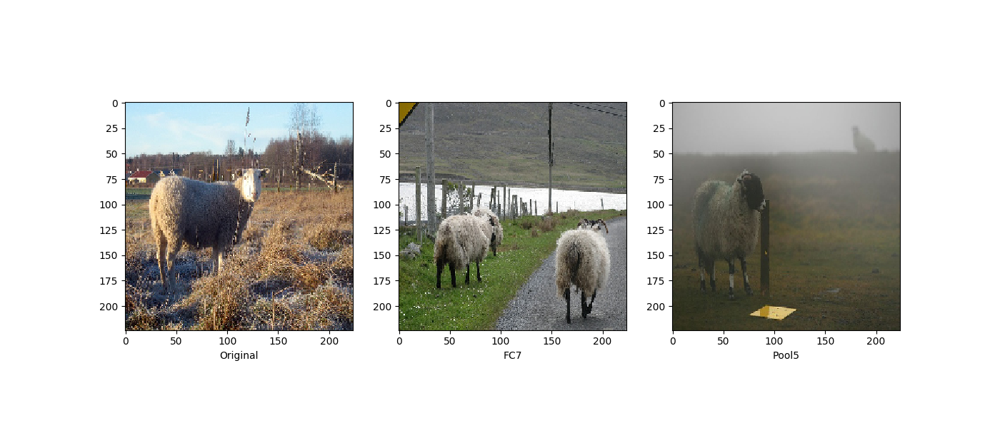

# Object Classification using Tensorflow

This repository contains the codes for training multi-label classification models using Tensorflow (Estimator API).

Requirements:

1. TensorFlow (1.3+)
2. Numpy
3. Pillow (PIL)
4. sklearn (v0.19)

Networks trained:

1. Shallow 2 layer network
2. AlexNet
3. VGG-16 (From scratch and ImageNet pretrained)

Dataset used:

1. MNIST
2. PASCAL 2007

Sample Results of Nearest Neighbor Analysis at FC7 and Pool5:

